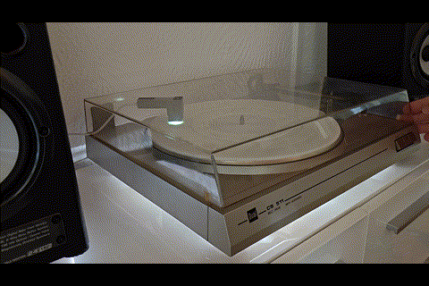
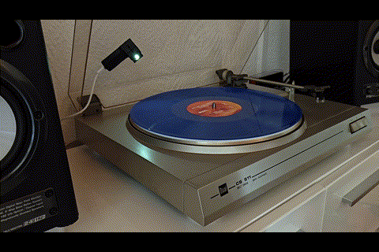
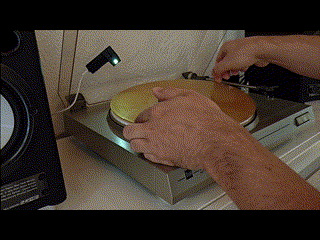
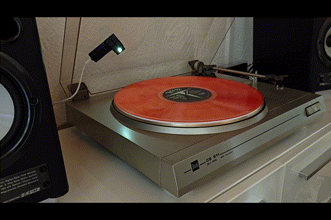

# 🎵 VinylChroma — Let Your Vinyl Shine 🌈

<p align="center">
  
  
</p>
<p align="center">
  
  
</p>

<h3 align="center">Bring your vinyl colors to life and let them set the mood — from a subtle turntable glow to lighting up your room or your entire home.</h3>

## **Stable release: v1.0.0**

VinylChroma is ESP32-S3/ESP32-C3 firmware that measures the color of a vinyl record with
up to four TCS34725 sensors and sends the accepted color to a separate
[WLED](https://github.com/wled/WLED) controller over its HTTP JSON API. The
VinylChroma controller handles sensing,
calibration, averaging, presence detection, and output decisions; it does not
drive the addressable LED strip data line itself.


## ✨ Features

- One to four independently configurable TCS34725 color sensors
- Direct I²C operation for one sensor or TCA9548A multiplexing for two to four
- Automatic, shared-manual, and per-sensor gain/integration control
- Per-sensor white calibration with dark/white light references and optional RGB fine-tuning
- Instant, rolling-time, and turntable-revolution averaging
- Vinyl presence detection through the exposure-normalized Clear channel
- Configurable color acceptance, default-color, and WLED-off timers
- Adjustable output Value normalization after sensor weighting and averaging
- Optional calibrated darkness cutoff for very dark detected vinyl colors
- WLED segment selection, optional brightness transmission, and optional effect preservation
- Static color overrides plus RGB Rainbow and Marble test effects
- RAM-only color history, diagnostics, logs, and live sensor information
- Embedded responsive web interface with validation and concise help text
- Configuration backup/restore, browser-based OTA updates with a persistent allow/deny switch, and factory reset
- Optional HTTP Basic Authentication for the web interface and built-in APIs
- Compile-time board profiles with board-specific defaults and GPIO validation

## 🧩 Supported Hardware

> [!IMPORTANT]
> Physical hardware testing has so far been performed only with the ESP32-S3
> Super Mini and one directly connected TCS34725 sensor. The other board
> profiles are included but have not yet been validated on physical hardware.
> Operation with more than one sensor through a TCA9548A multiplexer is
> experimental and has not yet been hardware-tested.

Community hardware reports are welcome. If you successfully use an untested
board profile or a multi-sensor setup, please open a
[GitHub issue](https://github.com/Gittegatt/VinylChroma/issues) and include the
exact board revision, selected PlatformIO environment, sensor configuration,
and any changes that were required. Such reports are marked as
**community-confirmed** and remain distinct from configurations physically
tested by the project author. Do not publish passwords, private IP addresses,
or configuration backups containing credentials.

### Controller board profiles

Select the environment that exactly matches the controller and its memory
variant. The names in the first column are the PlatformIO environment names.

| Environment | Controller | Memory variant | Validation |
| --- | --- | --- | --- |
| `esp32-s3-supermini` | ESP32-S3 Super Mini | Standard 4 MB flash / 2 MB PSRAM board | Author-tested |
| `esp32-s3-zero` | Waveshare ESP32-S3-Zero | 4 MB flash / 2 MB PSRAM | Not yet confirmed |
| `esp32-c3-supermini` | ESP32-C3 Super Mini | Standard 4 MB flash board | Not yet confirmed |
| `esp32-c3-zero` | Waveshare ESP32-C3-Zero | 4 MB flash | Not yet confirmed |
| `seeed-xiao-esp32-s3` | Seeed Studio XIAO ESP32-S3 | 8 MB flash / 8 MB PSRAM | Not yet confirmed |
| `adafruit-qtpy-esp32-s3-n4r2` | Adafruit QT Py ESP32-S3 N4R2 | 4 MB flash / 2 MB PSRAM | Not yet confirmed |
| `adafruit-qtpy-esp32-s3-nopsram` | Adafruit QT Py ESP32-S3 No PSRAM | 8 MB flash / no PSRAM | Not yet confirmed |
| `esp32-s3-tiny` | Waveshare ESP32-S3-Tiny | 4 MB flash / 2 MB PSRAM; no USB connector on the main PCB, so the initial flash requires a compatible USB adapter | Not yet confirmed |

Validation states distinguish **Author-tested** hardware from
**Community-confirmed** reports and profiles that are **Not yet confirmed**.

The generic Super Mini profiles target the common board revisions named above.
Clones with a different ESP32 package, flash size, PSRAM layout, USB circuit, or
pinout need a separate profile. PSRAM is configured where the official
PlatformIO board definition requires it, but VinylChroma does not currently
depend on PSRAM.

### Sensors and lighting

| Component | Quantity | Notes |
| --- | ---: | --- |
| TCS34725 breakout | 1–4 | Fixed I²C address `0x29` |
| TCA9548A multiplexer | 0 or 1 | Required when using two or more TCS34725 sensors; address `0x70` |
| Controllable sensor illumination | 1 per sensor | Driven through the configured LED-control GPIO |
| WLED controller and LED strip | 1 | Separate network device running WLED |

> VinylChroma supports TCS34725 sensors. TCS3200 sensors use a frequency-output
> interface and are not compatible with this firmware.

Use 3.3 V logic with the ESP32 and verify the electrical requirements of the
specific sensor breakout. All devices must share ground. Do not drive a lamp or
high-current LED load directly from an ESP32 GPIO; use the breakout's logic-level
LED control or a suitable driver circuit.

## 🔌 Default Wiring

Ground and sensor power are common to every profile:

| Signal | Connection | Function |
| --- | --- | --- |
| GND | GND | Common ground |
| Sensor supply | 3.3 V | Sensor/multiplexer supply when supported by the breakout |

The signal defaults depend on the selected environment:

| Environment | SDA | SCL | Sensor 1 LED | Sensor 2 LED | Sensor 3 LED | Sensor 4 LED |
| --- | ---: | ---: | ---: | ---: | ---: | ---: |
| `esp32-s3-supermini` | 12 | 13 | 11 | 10 | 9 | 8 |
| `esp32-s3-zero` | 12 | 13 | 11 | 10 | 9 | 8 |
| `esp32-c3-supermini` | 4 | 5 | 6 | 7 | 10 | 3 |
| `esp32-c3-zero` | 4 | 5 | 6 | 7 | 3 | 1 |
| `seeed-xiao-esp32-s3` | 5 | 6 | 1 | 2 | 4 | 7 |
| `adafruit-qtpy-esp32-s3-n4r2` | 7 | 6 | 18 | 17 | 9 | 8 |
| `adafruit-qtpy-esp32-s3-nopsram` | 7 | 6 | 18 | 17 | 9 | 8 |
| `esp32-s3-tiny` | 12 | 13 | 11 | 10 | 9 | 8 |

Pin numbers are GPIO numbers, not connector-position numbers. Sensor
illumination pins are PWM outputs.

With no TCA9548A detected, only **Sensor 1** can be used directly on the I²C
bus. With a TCA9548A, connect all active TCS34725 sensors behind the
multiplexer. The factory channel assignment is 0–3 for Sensors 1–4; the web
interface allows four unique channels from 0–7. Do not combine a direct-bus
TCS34725 with multiplexed TCS34725 sensors.

Each compiled profile exposes only its conservative, board-specific GPIO
allowlist in **Sensors**. Onboard RGB LEDs, native-USB pins, flash/PSRAM pins,
and boot-strapping pins are excluded where applicable. SDA, SCL, and all four
illumination GPIOs must be unique. The WebGUI shows the selected board profile,
its complete allowed list, and its reservation notes above the GPIO fields.

## 🏗️ 3D Printable Enclosure

I designed a dedicated 3D-printable enclosure for VinylChroma that provides space for the ESP32-S3 SuperMini and the TCS34725 color sensor, including the sensor light shield and PCB mounting features.

The firmware and source code remain freely available here on GitHub. The optional enclosure STL files are available separately on Cults3D.

If you like this project and would like to support its development, purchasing the enclosure model would be greatly appreciated!

**[Get the VinylChroma enclosure on Cults3D](https://cults3d.com/de/modell-3d/gadget/vinylchroma-combined-case-for-controller-and-sensor)**

## 🚀 Getting Started

### ⚡ Fast Flash with Prebuilt Images

Each GitHub release provides two prebuilt images for every controller profile.
Download the files whose environment name exactly matches the board. Using an
image for another controller or memory variant can result in an unbootable
device, incorrect GPIO assignments, or an incompatible flash layout.

| Image suffix | Intended use |
| --- | --- |
| `-factory.bin` | Initial USB flash, recovery, or installation after a full flash erase |
| `-ota.bin` | Browser OTA update of an already running matching board profile |

#### Easiest and Fastest Method: Browser Factory Flash

The easiest and fastest first installation uses
[ESPWebTool](https://esptool.spacehuhn.com/) and the matching Factory Image:

1. Download the `-factory.bin` whose environment name exactly matches the board.
2. Open ESPWebTool in a Web Serial-compatible browser and connect the controller's USB serial port.
3. Keep only one file row and delete all additional rows.
4. Set its flash address to `0x0000`. If the tool displays `0x` before the input, enter only `0`.
5. Select the matching `-factory.bin` file.
6. Click **ERASE**. This removes all existing settings and calibration data.
7. Reconnect the serial port if requested, then click **PROGRAM**.
8. Reset the controller once if it does not restart automatically.

Do not split a VinylChroma Factory Image across the bootloader, partition,
OTA-metadata, and application offsets. The single merged image already contains
all required components at their correct positions.

Flash the matching **Factory Image** at address `0x0000` with a compatible serial
flashing tool. It contains the bootloader, partition table, OTA boot metadata,
the VinylChroma application, and any additional board-specific boot image at
their required flash offsets.

> [!WARNING]
> Never upload a `-factory.bin` through the VinylChroma WebGUI. Browser OTA
> expects only the application image and writes it into an OTA application
> partition. A combined Factory Image contains bootloader and partition data
> for address `0x0000`; treating it as an application can leave the controller
> unable to boot the update.

After the initial flash, connect VinylChroma to the network and enable
**OTA Flash Allowed** plus **Browser OTA** under **System → Firmware OTA**. Every
later update can then use the matching `-ota.bin`. A new Factory Image is needed
only for recovery, after a full flash erase, or when the required flash layout
changes.

Release downloads also contain `SHA256SUMS.txt` for verifying file integrity.

### 📦 Build Requirements

- [PlatformIO](https://platformio.org/) Core CLI or the PlatformIO IDE extension
- A USB data cable for the initial flash
- The project files from this repository

Dependencies are version-constrained in `platformio.ini` and are installed automatically by
PlatformIO.

To build all versioned OTA and Factory Images locally, run:

```powershell
python scripts/build_release.py
```

The files are written to `dist/v<version>/`. Passing `--environment <name>`
builds only one board profile. Tagged GitHub builds create a draft release so
that its assets can be checked before publication.

### Select a board profile

Do not comment or uncomment environments in `platformio.ini`. In VS Code, open
**PlatformIO → Project Tasks**, expand the required environment, and choose its
**Build** or **Upload** task. The PlatformIO environment selector in the status
bar can also select the active profile. From the command line, pass the profile
explicitly with `-e`:

```powershell
pio run -e <environment>
pio run -e <environment> -t upload
```

`esp32-s3-supermini` remains the default only for commands that omit `-e`.
Selecting the correct profile is mandatory: it controls the MCU variant,
memory/partition layout, USB behavior, default wiring, and GPIO validation.

### ⚡ Build and Initial USB Flash

For example, for the ESP32-S3 Super Mini, run from the repository root:

```powershell
pio run -e esp32-s3-supermini
pio run -e esp32-s3-supermini -t upload
```

If automatic serial-port detection fails, specify the actual port:

```powershell
pio device list
pio run -e esp32-s3-supermini -t upload --upload-port COM5
```

Replace `COM5` with the port reported for your controller, for example
`/dev/ttyACM0` on Linux.

The firmware image is generated in the selected environment's build directory:

```text
.pio/build/<environment>/firmware.bin
```

The web interface is embedded in the firmware. No filesystem image or
`uploadfs` step is required. A clean build is normally unnecessary; use
`pio run -e <environment> -t clean` only when investigating stale artifacts or
toolchain issues.

### 📶 First Start and Factory Defaults

The following access point is created after a factory reset or when no station
Wi-Fi configuration is available:

| Setting | Default |
| --- | --- |
| SSID | `VinylChroma` |
| Password | `vinyl!1234` |
| Web interface | `http://192.168.4.1` |

Connect to the access point, open the web interface, and configure the target
Wi-Fi network. After joining the network, VinylChroma is available at its DHCP
address and usually at `http://vinylchroma.local`. If station connection fails,
the fallback access point starts again after the configured delay when it is
enabled.

Change the public default fallback-AP password during setup. Web Access
Protection is disabled by default and should be enabled when other clients can
reach the device.

### ⚙️ Initial Configuration

1. Open **Sensors** and verify the I²C GPIOs, illumination GPIOs, and TCA channels.
2. Enable the installed sensors and confirm they are detected on the Dashboard.
3. Set the illumination brightness and exposure mode.
4. Place a neutral matte white reference beneath every active sensor and run
   **White Calibration**. Keep it in place while VinylChroma first captures the
   LED-off baseline and then the illuminated white reference.
5. Open **WLED**, enter the WLED host without `http://`, then set its port and segment.
6. Configure presence detection, averaging, acceptance delay, and absence timers under **Vinyl**.

Recalibrate after changing sensor geometry, illumination brightness, LED
correction, TCA wiring, or an individual sensor.

### ✅ Recommended Starting Settings

The following values are taken from my setup with one TCS34725
and an ESP32-S3 Super Mini. They are a practical starting point, not universal
calibration targets; sensor distance, illumination, enclosure geometry, record
material, and the WLED installation can require adjustment.

| Setting | WebUI location | Recommended start | Notes |
| --- | --- | --- | --- |
| Active sensors | **Sensors → Sensor 1** | Sensor 1 only | Set Sensor 1 to 100% weight and LED Correction to 1.0; disable unused sensors. |
| Sensor illumination | **Sensors → Sensor Illumination** | 20%, continuously enabled | **Only During Measurement** is disabled. Recalibrate after changing brightness. |
| Sensitivity Mode | **Sensors → Measurement and Sensitivity** | Automatic | Sensor 1 starts at 16× gain and 154 ms integration; automatic Clear thresholds are 3000 and 52000. |
| Sample Interval | **Sensors → Measurement and Sensitivity** | 200 ms | Provides fast updates while leaving time for sensor acquisition and network handling. |
| Averaging Mode | **Sensors → Measurement and Sensitivity** | Instant | Rolling Window, RPM, and Revolutions are stored but inactive in this mode. |
| Presence detection | **Vinyl → Vinyl Detection and Timers** | Enabled | Uses the normalized Clear channel to detect a record. |
| Clear Threshold | **Vinyl → Vinyl Detection and Timers** | 400 | Installation-specific: verify it remains above the empty/background reading and below the darkest record to detect. |
| Required Sensors | **Vinyl → Vinyl Detection and Timers** | 1 | Matches the tested single-sensor setup. |
| Color Change Threshold | **Vinyl → Vinyl Detection and Timers** | 5 | Responds to small color changes; increase it if measurement noise causes unnecessary updates. |
| Accept Color After | **Vinyl → Vinyl Detection and Timers** | 0.0 s | Accepts a changed color immediately. Increase slightly if the output is not stable enough. |
| Output Saturation | **Vinyl → Detected Color Output** | 100% | Preserves the accepted sensor saturation; adjust only after calibration. |
| Vinyl Output Value Normalization | **Vinyl → Detected Color Output** | 100% | Raises the strongest accepted RGB channel to full Value; reduce it to preserve measured brightness. |
| Darkness Cutoff | **Vinyl → Darkness Cutoff** | Enabled at 4% | Requires valid White Calibration at the current 20% illumination setting. |
| Absence timers | **Vinyl → Vinyl Detection and Timers** | Default after 5 s; WLED off after 10 s | The Default Color is neutral gray `#808080`; the off delay must remain longer than the default delay. |
| WLED target | **WLED** | Port 80, Segment 0 | Enter the hostname or IP address of the user's own WLED controller. |
| Minimum WLED Update Interval | **WLED** | 200 ms | Gives responsive output while limiting repeated HTTP requests. |
| Send Brightness | **WLED** | Disabled | Leaves brightness under WLED control; the stored VinylChroma brightness value is not transmitted. |
| Keep Selected WLED Effect | **WLED** | Enabled | Preserves the active effect, which may reinterpret the incoming color; disable it for predictable Solid color matching. |

Run **White Calibration** at 20% illumination before judging color accuracy.
Stored automatic calibration factors, dark/white references, and my
manual RGB correction are sensor- and installation-specific and must not be
copied to another unit. Start Manual Color Tuning at 100% red, green, and blue,
then adjust only if a calibrated sensor still has a repeatable tint. Network,
authentication, Developer Mode, and OTA values are intentionally excluded from
this table because they are device-specific or security decisions.


## 🎛️ Configuration Ranges & Tweaks

| Setting | Range |
| --- | --- |
| Rolling window | 0.1–300.0 s |
| RPM | 1–1000 |
| Revolutions | 0.1–20.0 |
| Clear threshold | 0–65535 |
| Required sensors | 1–4 |
| Color-change threshold | 0–764 |
| Color-acceptance delay | 0.0–300.0 s |
| Default-color and WLED-off delays | 0–300 s |
| Output saturation | 0–200%; 0% removes color, 100% is unchanged, and values above 100% increase saturation |
| Output Value normalization | 0–100% |
| Darkness cutoff | 0.0–100.0% (disabled by default) |


## WLED 🔵🔴🟠🟡🟢
### 🎨 WLED Output Options

- **WLED Transmission Enabled** sends accepted colors and automatic on/off commands.
- **Send Brightness** includes the configured global WLED brightness; when disabled,
  VinylChroma leaves WLED brightness unchanged.
- **Keep Selected WLED Effect** omits the command that selects Solid mode. The active
  WLED effect may ignore or reinterpret the incoming color.

WLED transitions, gamma correction, current limiting, color order, and RGBW
behavior remain WLED settings.

### 🔦 Darkness Cutoff

After White Calibration, the **Vinyl** page shows a relative light level from
`0%` at the stored LED-off baseline to `100%` at the illuminated white
reference. This is a relative sensor value, not laboratory lux or reflectance.

**Turn WLED Off for Dark Readings** sends an actual WLED off command when the
level of an already detected record remains below the configured threshold.
Presence detection and absence timers are not changed, and debug overrides and
effects bypass the cutoff. The option is disabled by default.


## 📡 OTA Updates

VinylChroma supports firmware updates both through the web interface and directly from PlatformIO over Wi-Fi.

### 🌐 Browser OTA
All OTA methods are disabled by default. Under **System → Firmware OTA**, enable
the master **OTA Flash Allowed** checkbox and its **Browser OTA** child checkbox,
then save before selecting `firmware.bin`.
Upload only the firmware image built for the board profile currently running on
the controller.

A successful update reboots the controller automatically.

OTA permission settings are stored in NVS and remain unchanged after a normal
OTA update, so OTA does not need to be enabled again after the reboot. The
disabled defaults apply only to a new configuration, a factory reset, or a full
flash erase.

Disabling **OTA Flash Allowed** blocks both browser and PlatformIO OTA regardless
of the two child settings. Disabling only **Browser OTA** makes the `/update`
endpoint reject firmware uploads before writing to flash. These settings do not
disable USB flashing, so OTA can still be restored with a USB upload if web
access is lost.

### >_ PlatformIO OTA

For later firmware updates over Wi-Fi, first enable both **OTA Flash Allowed**
and **PlatformIO OTA** under **System → Firmware OTA**. Then use the `-ota`
companion of the same board profile. For example:

```ini
[env:esp32-s3-supermini-ota]
upload_protocol = espota
upload_port = vinylchroma.local
```

From the repository root:

```powershell
pio run -e esp32-s3-supermini-ota
pio run -e esp32-s3-supermini-ota -t upload
```

If the controller uses a different IP address, specify it directly:

```powershell
pio run -e esp32-s3-supermini-ota -t upload --upload-port <controller-ip-address>
```

Replace `<controller-ip-address>` with the current IP address of your
VinylChroma controller. This override is useful when mDNS is unavailable or the
configured hostname is no longer `vinylchroma`.

The controller must already be connected to the same network and the PlatformIO
OTA service must be enabled before an `espota` upload can be performed. Every
USB environment listed above has a matching `<environment>-ota` companion.

The OTA build image is generated at:

```text
.pio/build/<environment>-ota/firmware.bin
```

The web interface is embedded in the firmware. No filesystem image or
`uploadfs` step is required.

A clean build is normally unnecessary. Use:

```powershell
pio run -e esp32-s3-supermini-ota -t clean
```

only when investigating stale artifacts or toolchain issues.


## 💾 Persistence

### Stored in NVS

Preserved across normal reboots and firmware uploads:

- Wi-Fi and fallback-AP configuration
- GPIO, sensor, averaging, timer, and WLED settings
- White/dark calibration references and manual per-sensor corrections
- Web authentication and OTA-permission configuration
- The compiled board-profile identifier

### RAM-only Data

Cleared on every reboot:

- Color History
- Debug overrides and simulations
- Runtime logs

### Configuration Backup

Configuration imports are limited to 16 KB. Exports include stored Wi-Fi,
fallback-AP, and web-login passwords, so treat exported JSON files as secrets.

### 🔄 Flash Behavior During Updates

Normal USB, browser OTA, and PlatformIO OTA uploads using the same partition
layout preserve settings and calibration.

Configuration backups contain their source board-profile identifier. Importing
a backup made on another supported profile keeps board-independent settings,
but replaces the GPIO mapping with the current board defaults and invalidates
sensor calibration and manual sensor correction. Rewire and recalibrate before
normal operation. A firmware image for a different board or memory variant must
never be installed through browser or PlatformIO OTA.

A full flash erase, factory reset, or incompatible partition-table change can
remove or invalidate stored data.

A full flash erase cannot be performed over OTA. Use the USB environment and a
serial connection when `erase` is required.


## 🔐 Security

- The web interface, API, OTA upload, and WLED requests use unencrypted HTTP.
- Optional Web Access Protection uses HTTP Basic Authentication, not TLS.
- OTA images are not signed, and firmware authenticity is not verified.
- OTA uploads are disabled by default. Enable the master switch and only the
  required OTA method under **System → Firmware OTA**.
- The WLED client does not support WLED authentication or HTTPS.
- Use VinylChroma only on a trusted local network or an appropriately isolated VLAN.


## 🛠️ Troubleshooting

- If the updated GUI looks stale, perform a hard refresh (`Ctrl+F5`).
- If Wi-Fi cannot connect, wait for the fallback access point when it is enabled
  and use it to correct the station credentials.
- If neither station Wi-Fi nor the fallback access point can be reached, connect
  through USB, run `pio run -e <environment> -t erase`, and upload the matching
  environment again. This erases all stored settings and calibration data.
- If sensors are missing, first enable **System → Developer Mode**, then use
  **Diagnostics → Refresh / Scan I²C** and verify `0x29`/`0x70` wiring.
- If WLED shows a different result, check its active effect, transition, brightness,
  RGB/RGBW mode, color order, gamma correction, and power limiting.
- Do not erase flash or clean the build unless a specific problem requires it.

## 📁 Project Structure

| Path | Purpose |
| --- | --- |
| `include/` | Configuration, hardware, state, and component interfaces |
| `include/BoardProfile.h` | Per-board identity, default pins, and safe GPIO allowlists |
| `src/` | Firmware implementation and embedded web interface |
| `scripts/build_release.py` | Builds versioned OTA images, merged Factory Images, and SHA-256 checksums |
| `scripts/export_flash_manifest.py` | Exports PlatformIO's resolved board-specific flash layout for release packaging |
| `.github/workflows/release-images.yml` | Builds all release assets and prepares draft releases for version tags |
| `platformio.ini` | USB/OTA environments, build flags, memory layouts, and dependencies |
| `.pio/` | Generated local build output; excluded from Git |

## 📄 License

VinylChroma is source-available under the
[PolyForm Noncommercial License 1.0.0](https://polyformproject.org/licenses/noncommercial/1.0.0).

Required Notice: Copyright 2026 Gittegatt

Personal, educational, research, hobby, and other noncommercial use is
permitted subject to the license terms. Commercial use requires a separate
written license from the copyright holder. Because commercial use is
restricted, this is not an OSI-approved open-source license. Third-party
components remain subject to their respective licenses.

## ✉️ Contact

For project information and commercial licensing inquiries, visit
[github.com/Gittegatt/VinylChroma](https://github.com/Gittegatt/VinylChroma)
